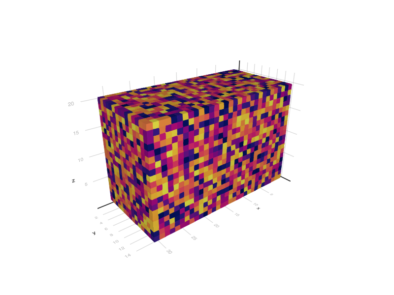
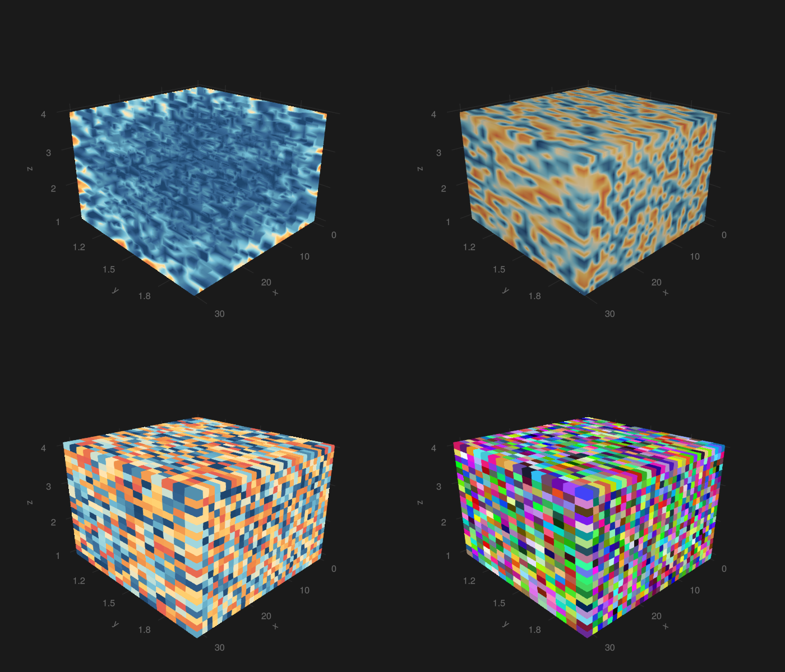
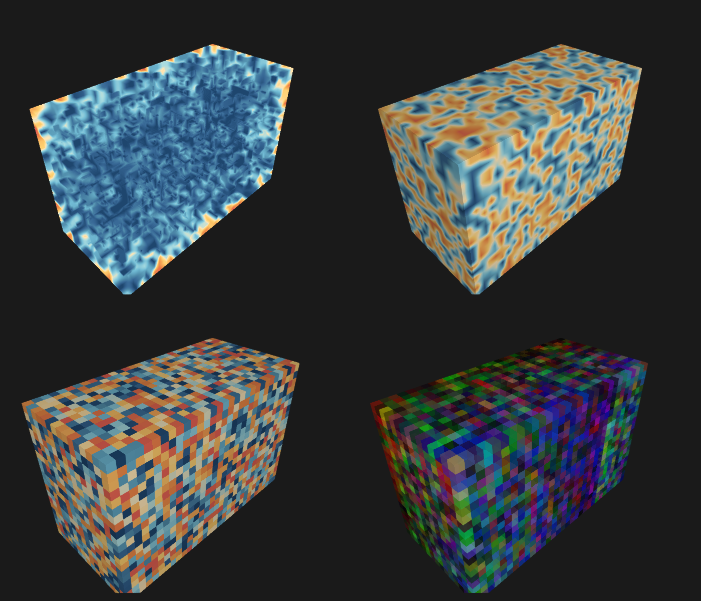
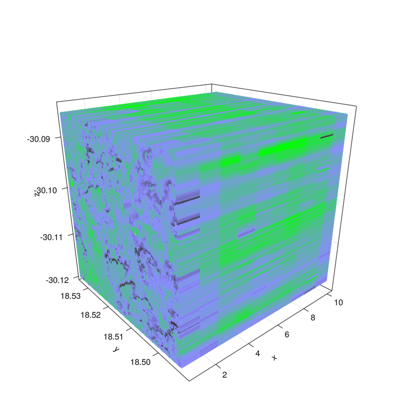
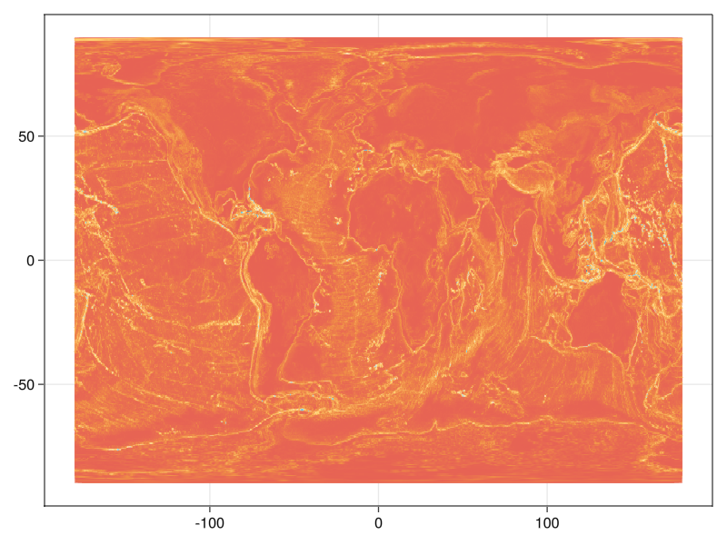
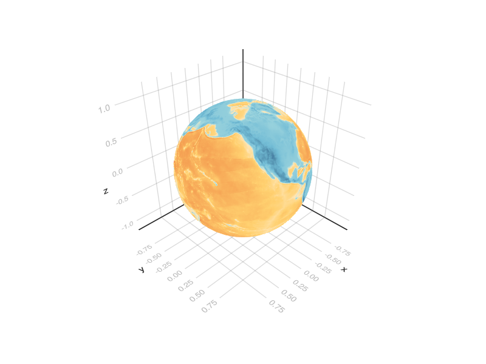
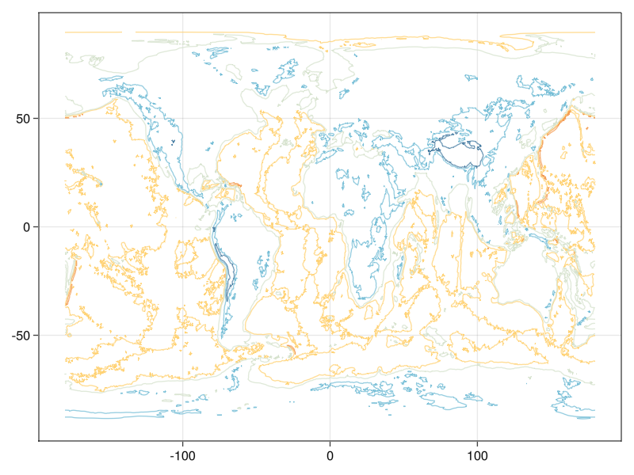
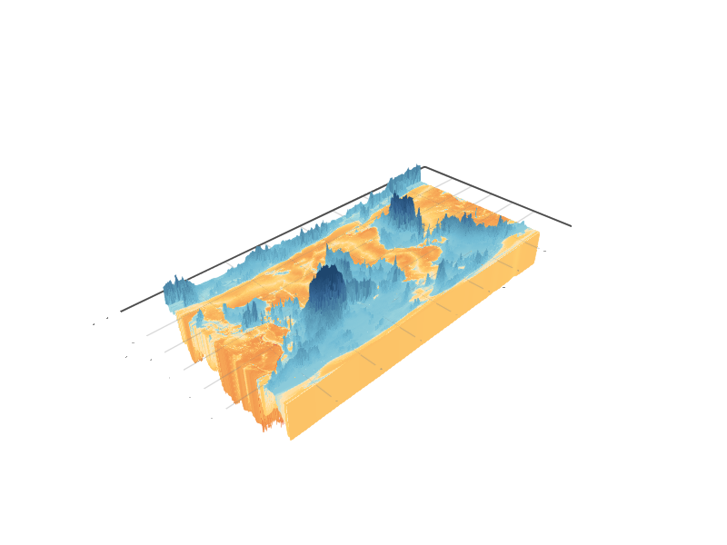

# EarthDataVis
WIP: More features will come soon!

## Installation

```julia
julia>]
pkg> add https://github.com/lazarusA/EarthDataVis.git
```

## Quick start

```julia
using EarthDataVis, GLMakie
```

- Current functions:
  - datacubeplot (for 3d: volume, contour and voxel)
  - mapplot (for 2d maps: heatmap, contour, scatter)
  - sphereplot (for 3d plots: surface and mesh)

Note, that you will also need GLMakie in order to create the plots. And,
since the recipes are designed to work with lazy loading from YAXArrays
we will need input in that format.

```julia
using YAXArrays, Dates, Colors
```

```julia
dates = Date(2021, 1, 1):Day(1):Date(2021, 1, 31)
axlist = [
    RangeAxis("time", dates),
    RangeAxis("lon", range(1, 10, length=15)),
    RangeAxis("lat", range(1, 15, length=20)),
    CategoricalAxis("Variable", ["var1", "var2"])]
data = rand(length(dates), 15, 20, 2)
dsarr = YAXArray(axlist, data)
```
```
YAXArray with the following dimensions
time                Axis with 31 Elements from 2021-01-01 to 2021-01-31
lon                 Axis with 15 Elements from 1.0 to 10.0
lat                 Axis with 20 Elements from 1.0 to 15.0
Variable            Axis with 2 elements: var1 var2
Total size: 145.31 KB
```

Then, plotting our first cube is done with

```julia
datacubeplot(dsarr; kind=:voxel, colormap=:linear_bmy_10_95_c71_n256)
save("./imgs/voxel.png", current_figure())
```



Currently, 3 options are supported, :volume, :contour and :voxel. In the
:voxel mode you can pass also an array of RGB color per box.

```julia
 # some rgb colors also per data point.
rgb = [RGBA(rand(3)...,) for r in 1:length(dates), g in 1:15, b in 1:20]
```

```julia
fig = with_theme(theme_dark()) do
    fig = Figure(resolution=(1400, 1200))
    axs = [Axis3(fig[i, j]; perspectiveness=0.5f0, azimuth=1.275π * 1.77) for i in 1:2 for j in 1:2]
    for (k, kind) in enumerate([:volume, :contour, :voxel])
        datacubeplot!(axs[k], dsarr; kind, axvals=:vals)
    end
    datacubeplot!(axs[4], dsarr; kind=:voxel, axvals=:vals, color=vec(rgb))
    fig
end

save("../imgs/simpleVCVrgb_axis3.png", fig)
```


```julia
fig = with_theme(theme_dark()) do
    fig = Figure(resolution = (1400, 1200))
    axs = [LScene(fig[i,j]; show_axis = false) for i in 1:2 for j in 1:2]
    for (k,kind) in enumerate([:volume, :contour, :voxel])
        datacubeplot!(axs[k], dsarr; kind)
    end
    datacubeplot!(axs[4], dsarr; kind = :voxel, color =vec(rgb))
    fig
end
save("./imgs/simpleVCVrgb.png", fig)
```


## Featuring geo-data

### Data cube

```julia
using EarthDataVis
using GLMakie, YAXArrays, Dates, NetCDF
using Colors
# a .nc file in your data folder
dsarrC = Cube("./data/34JBM1608_2017-06.nc")

fig = Figure(resolution = (800,800))
ax = Axis3(fig[1,1], aspect = (1,1,1), perspectiveness= 0.5)
datacubeplot!(ax, dsarrC; kind=:voxel, xname = :longitude, yname = :latitude,
    axvals=:vals, varname="ndvi_target", shading = false,
    colormap=:fastie, colorrange=(-1,1))
fig
```


### Global 3d options

```julia
using EarthDataVis
using GLMakie, YAXArrays, Dates, NetCDF
using Colors
# a .nc file in your data folder
dsarr = Cube("./data/ETOPO1_halfdegree.nc")
mapplot(dsarr)
```


```julia
sphereplot(dsarr; kind = :mesh, varname=:ETOPO1avg)
```


```julia
mapplot(dsarr; kind=:contour, varname=:ETOPO1avg)
```


```julia
bar3dplot(dsarr; varname=:ETOPO1avg, scalez = 1/100)
```


### Acknowledgements
DeepCube
